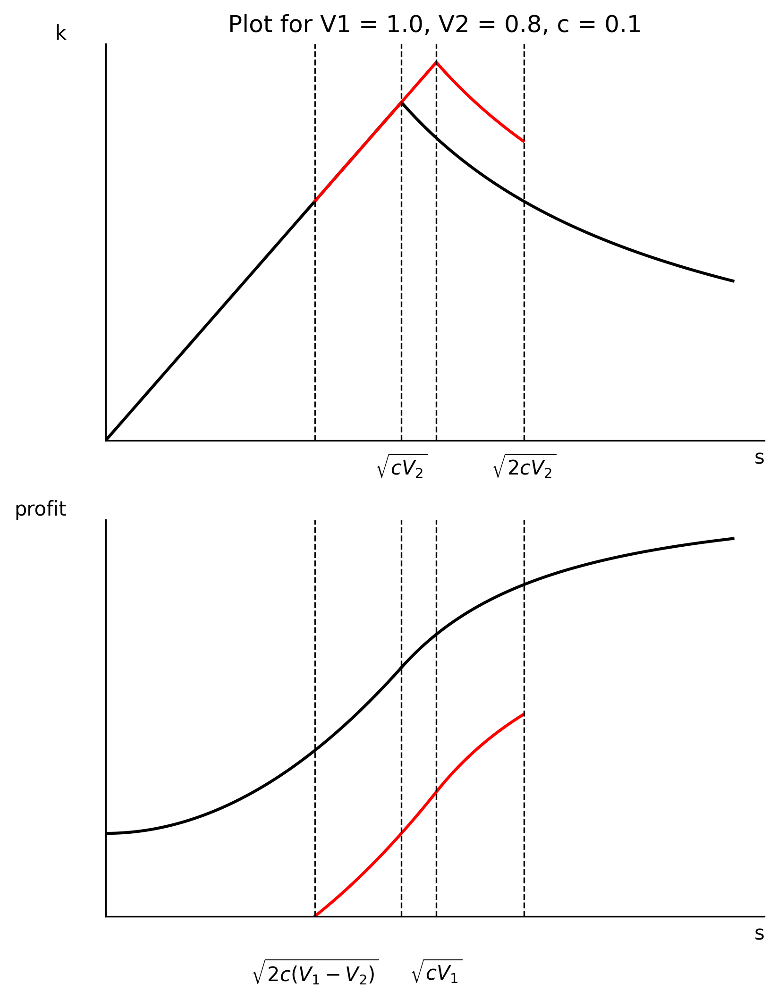

\newpage

# Quarto

Quarto enables you to weave together content and executable code into a finished document. To learn more about Quarto see <https://quarto.org>.

# YAML header

Øverst i dokumentet ser du YAML hvor du kan spesifisere en del parametre for ditt dokument. Liste med YAML for pdf finner du [her](https://quarto.org/docs/reference/formats/pdf.html). echo: false er innstillingen for å utelate all kode fra dokumentet. Dette kan du overstyre dersom det er visse kodesnutter som du vil vise.

# Tekst og matte

Vi ser på en **konsument** som kan *kjøpe* gode $x_1$ og $x_2$.

Konsumentens preferanser uttrykkes gjennom en nyttefunksjon:

$$U(x_1,x_2)$$
 {#eq-nytte}

Konsumenten liker begge goder, dvs $\frac{\partial U}{\partial x_1}>0, \frac{\partial U}{\partial x_2}>0$

Vi ser at @eq-nytte viser nyttefunksjonen. Videre er @eq-nytte viktig.

# Kode

Velg "Executable cell-R" (ctrl+alt+I).

```{r}

```

```{r}
#| label: fig-indkurver
#| fig-cap: "Indifferenskurver"


rm(list = ls())


suppressPackageStartupMessages(library(tidyverse))


#lag aksen for tegningen

axes_1 <- ggplot()+
  labs(x=expression(x[1]), y=expression(x[2]))+
  theme(axis.title = element_text(size = 20),
        plot.title = element_text(size = 20),
        panel.background = element_blank(), # hvit bakgrunn
        axis.line = element_line(colour = "black"))+ # sett inn akselinjer
  coord_fixed(ratio = 1)+ # lik skala for x og y aksen
  scale_x_continuous(limits = c(0, 20), expand = c(0, 0))+
  scale_y_continuous(limits = c(0, 20), expand = c(0, 0)) # begrense aksene
# og sikre at akselinjene møttes i (0,0).

# vi angir noen indifferenskurver

I_0 <- function(x_1) (5^2)/x_1 # nyttenivå 5
I_1 <- function(x_1) (7^2)/x_1
I_2 <- function(x_1) (9^2)/x_1

figur_1 <- axes_1 + 
  stat_function(
        fun=I_0,
        mapping = aes()
        ) +
  stat_function(
                fun=I_1,
                mapping = aes()
  ) +
  stat_function(
                fun=I_2,
                mapping = aes()
  )+
  annotate("text",x=19,y=1, label=expression(u[0]))+
  annotate("text",x=19,y=3.3, label=expression(u[1]))+
  annotate("text",x=19,y=5.3, label=expression(u[2]))

figur_1
```

@fig-indkurver vises i den kompilerte pdf, men ikke kode. @fig-indkurver

\newpage

Jeg kan velge å vise koden ved å skrive `#| echo: true` øverst i snutten jeg vil vise

```{r}
#| label: fig-mrs
#| fig-cap: "Marginal substitusjonsbrøk"
#| echo: true
figur_2 <- axes_1+
  stat_function(
                fun=I_1,
                mapping = aes()
  )+
  annotate("text",x=19,y=3.3, label=expression(u[1]))+
  geom_segment(aes(x=0, y=17.9, xend=10.8, yend=0))+
  geom_segment(aes(x=5, y=0, xend=5, yend=9.8), linetype="dashed")+
  geom_segment(aes(x=0, y=9.8, xend=5, yend=9.8), linetype="dashed")
  

figur_2
```

@fig-mrs er vakker.

I @fig-budsjett tegner vi konsumentens budsjett.

```{r}
#| label: fig-budsjett
#| fig-cap: "Konsumentens budsjett"

buds_0 <- function(x_1) 18-1.5*x_1

figur_3 <- axes_1+
  labs(title="Konsumentens budsjett")+
  stat_function(
                fun=buds_0,
                mapping = aes()
  )+
  annotate("text",x=4.5,y=18, label=expression(m/p[2]))+
  geom_segment(aes(x=3, y=18, xend=.2, yend=18),
               arrow = arrow(length = unit(0.25, "cm")))+
  annotate("text",x=12,y=4., label=expression(m/p[1]))+
  geom_segment(aes(x=12, y=3, xend=12, yend=.2),
               arrow = arrow(length = unit(0.25, "cm")))

figur_3
```

Vi har tegnet konsumentens budsjett (se @fig-budsjett).

# Tabeller

```{r}
#| label: tbl-iris
#| tbl-cap: "Iris Data"

library(knitr)
kable(head(iris))

```

I @tbl-iris ser vi noe data.

Vi kan også lage en tabell ved hjelp av nedtrekksmenyen

| Navn  | Alder | Høyde |
|-------|-------|-------|
| Alfa  | 6     | 77    |
| Beta  | 5     | 85    |
| Gamma | 4     | 91    |

: Alder og høyde

See @tbl-tall.

@fig-bilde er satt inn ved hjelp av "Insert" funksjonen. Det kan være vanskelig å kontrollere hvor den plasseres i pdf dokumentet, men legg merke til kommandoen i YAML `fig-pos = 'H'` skal tvinge bilder og figurer til å skrives ut hvor de kommer i teksten. Du kan også bruke en liten 'h' som betyr ca. her (her kan du redusere hvite deler av sider, men det kan flytte på figuren og sette den på en uønsket plass); 'ht' betyr her eller i toppen av neste side.

{#fig-bilde fig-align="center" width="600"}

# Flere artige funksjoner

## Sitering

Du kan kalle fra ditt bibliotek (.bib) som du lagrer i samme mappe som dokumentet du jobber i. Min fil heter `eksempel.bib` . Jeg har også lastet ned apa stilen fra [Zotero](https://www.zotero.org/styles) (søk etter apa 7). Da kan du sitere ved å trykke på "alfa-krøll", eller bruke nedtrekksmenyen "Insert". @clark1998competition viser en ting, mens @clark2007contests viser noe helt annet.

Det er mulig å bruke [Google scholar](https://scholar.google.com/) til å lage en .bib fil, eller [Zotero](https://www.zotero.org/) (som er gratis å laste ned og bruke). For å koble ditt bibliotek i Zotero til RStudio, velg Tools -\> Global options -\> R Markdown -\> Citations.

Når du går inn på Insert -\> Citation får du opp Zotero som mulighet.

## Fotnoter

Disse kan settes inn fra nedtrekksmenyen "Insert".[^1]

[^1]: Som på dette viset.

# Referanser
